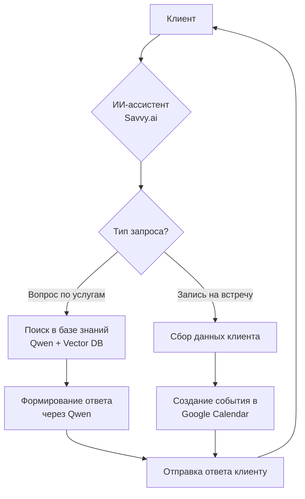

# ИИ-ассистент для компании «Эвлитос»  
*Автоматизация клиентского сервиса в сфере изготовления и установки памятников*

Ссылка на проект - @evlitoss_manager_bot


---

## 📌 Обзор проекта

ИИ-ассистент для компании **«Эвлитос»** — это интеллектуальное решение для автоматизации первичного взаимодействия с клиентами, предоставляющее консультации по услугам компании, отвечающее на частые вопросы и организующее запись на личные встречи. Система снижает нагрузку на операторов, повышает скорость отклика и обеспечивает круглосуточную поддержку клиентов в деликатной сфере ритуальных услуг.

---

## 🏢 О компании «Эвлитос»

«Эвлитос» — компания, специализирующаяся на полном цикле услуг в сфере мемориальных изделий:
- ✦ Изготовление памятников из гранита, мрамора и других материалов
- ✦ Художественная гравировка портретов, надписей и орнаментов
- ✦ Продажа сопутствующих изделий (вазы, оградки, покрытия)
- ✦ Профессиональная установка памятников на кладбищах
- ✦ Консультации по выбору дизайна и материалов с учётом требований кладбищ

---

## 🤖 Функциональные возможности ассистента

### 1. Естественное диалоговое взаимодействие
- Поддержка контекстного диалога на русском языке
- Понимание намерений клиента: выбор памятника, уточнение сроков, стоимость услуг
- Тактичное общение с учётом специфики темы (уважительный тон, эмпатия)
- Обработка неоднозначных запросов и уточняющих вопросов

### 2. Консультации на основе базы знаний
Ассистент оперирует структурированной базой знаний компании:
- 📋 **Каталог услуг**: типы памятников, материалы, варианты гравировки
- 💰 **Ценообразование**: примерные расчёты стоимости в зависимости от параметров
- ⏱️ **Сроки изготовления**: от стандартных до эксклюзивных заказов
- 📏 **Требования кладбищ**: ограничения по размерам, материалам в разных регионах
- 📦 **Дополнительные услуги**: доставка, установка, гарантийное обслуживание
- ❓ **FAQ**: ответы на частые вопросы («Можно ли установить памятник зимой?», «Какие фото подходят для гравировки?»)

### 3. Запись на встречу с интеграцией календаря
- 📅 Предложение удобного времени для личной консультации или замера
- 📱 Сбор контактных данных клиента (ФИО, телефон, email)
- 🔗 Автоматическое создание события в **Google Календарь** менеджера
- ✉️ Отправка клиенту подтверждения с деталями встречи и напоминанием

---

## ⚙️ Техническая архитектура

### Используемые сервисы и технологии

| Компонент | Сервис / Технология | Назначение |
|----------|---------------------|------------|
| **Языковая модель** | Qwen (Tongyi) | Генерация осмысленных ответов, обработка естественного языка |
| **Платформа ассистента** | [Savvy.ai](https://suvvy.ai/) | Хостинг чат-бота, управление диалогами, интеграции |
| **База знаний** | Qwen + Savvy Knowledge Base | Структурирование и векторизация информации о услугах |
| **Календарь** | Google Calendar API | Синхронизация записей на встречи |
| **Интерфейс** | Встраиваемый виджет Savvy | Размещение на сайте компании и в мессенджерах |

### Преимущества платформы Savvy.ai
- **Надёжность**: Работает на базе проверенных LLM, таких как Qwen.
- **Покрытие обращений**: Обрабатывает 100% входящих запросов.
- **Точность ответов**: До 95% корректных ответов благодаря интеграции с базой знаний.
- **Гибкость**: Возможность работы по сложным сценариям и интеграция с CRM, мессенджерами и маркетплейсами.

### Схема работы



---

## 📋 Этапы реализации

| Этап | Описание | Результат |
|------|----------|-----------|
| **1. Анализ и сбор данных** | Изучение услуг компании, сбор цен, сроков, FAQ | Структурированный документ с информацией |
| **2. Подготовка базы знаний** | Форматирование данных, создание промптов для Qwen | Оптимизированная база для векторного поиска |
| **3. Настройка системного промпта** | Прописывание правил общения, тона, ограничений | Промпт для тактичного и точного общения |
| **4. Интеграция в Savvy** | Загрузка базы знаний, подключение Qwen, настройка сценариев | Рабочий прототип ассистента |
| **5. Тестирование** | Проверка ответов на типовые запросы, отладка диалогов | Исправленные ошибки, улучшенная точность |
| **6. Подключение календаря** | Настройка Google Calendar API, шаблонов событий | Автоматическая запись встреч |
| **7. Внедрение** | Встраивание виджета на сайт компании | Готовый к использованию ассистент |

---

## ✅ Преимущества решения

| Для клиентов | Для компании |
|--------------|--------------|
| • Круглосуточная поддержка без ожидания оператора | • Снижение нагрузки на менеджеров на 30–40% |
| • Мгновенные ответы на базовые вопросы | • Фиксация всех обращений в системе |
| • Удобная запись на консультацию в 2 клика | • Повышение конверсии за счёт скорости отклика |
| • Тактичное и уважительное общение | • Стандартизация ответов на частые вопросы |
| • Доступ к информации 24/7 | • Освобождение времени менеджеров для сложных заказов |

---

## 🔮 Планы по развитию

- **Интеграция с CRM** — автоматическое создание карточки клиента при первом обращении
- **Голосовой интерфейс** — поддержка звонков через SIP-шлюз для пожилых клиентов
- **Генерация предварительного расчёта** — калькулятор стоимости на основе параметров памятника
- **Аналитика запросов** — выявление популярных вопросов для улучшения контента сайта
- **Мультиканальность** — развёртывание ассистента в WhatsApp, Telegram и ВКонтакте

---

## 📊 Метрики эффективности (рекомендуемые к отслеживанию)

```markdown
- Время первого ответа: < 5 секунд
- Удовлетворённость ответов (оценка клиентов): > 4.5 / 5
- Доля автоматически решённых запросов: 60–70%
- Конверсия в запись на встречу: 15–25%
- Снижение нагрузки на операторов: 35% за первый месяц
```

---

> 💡 **Ключевая ценность проекта**: ИИ-ассистент «Эвлитос» сочетает технологическую эффективность с человечным подходом к деликатной теме, обеспечивая клиентам поддержку в трудный момент, а компании — масштабируемость сервиса без потери качества общения.
